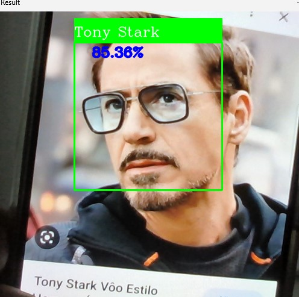
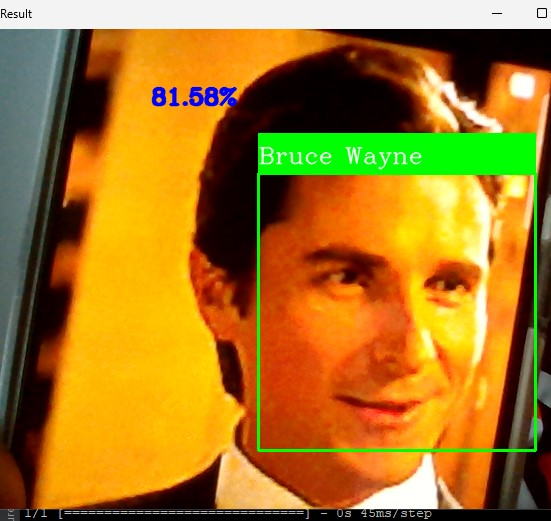

<h1>Reconhecimento Facial em Tempo Real</h1>
 

	Projeto de reconhecimento facial utilizando Python, Tensorflow, Keras e OpenCV. Treinamento realizado no <a href="https://teachablemachine.withgoogle.com/train/image">Teachable Machine</a>.

 

  Tony Stark</img>
  Bruce Wayne</img>

 

  
Projeto de reconhecimento facial utilizando imagens de câmera em tempo real. Foram treinadas 450 imagens para cada item no tensorflow keras do teachable machine

  
O <strong>image_collect.py</strong> captura a quantidade de imagens pré-determinadas, cria uma pasta em images para cada item, posteriormente essas pastas são subidas para o teachable machine para o treinamento. Para esse projeto o aplicativo foi definido para reconhecer 2 classes simultaneamente: Tony Stark e Bruce Wayne.

